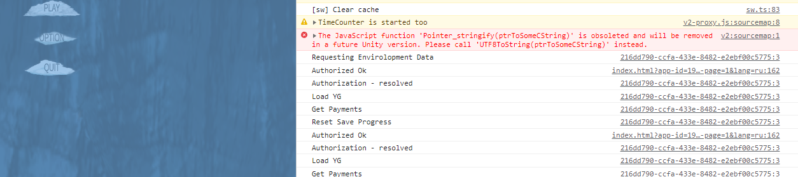
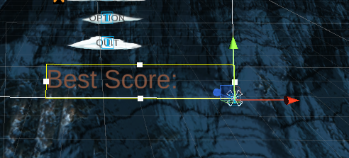
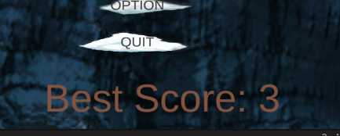
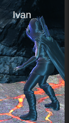
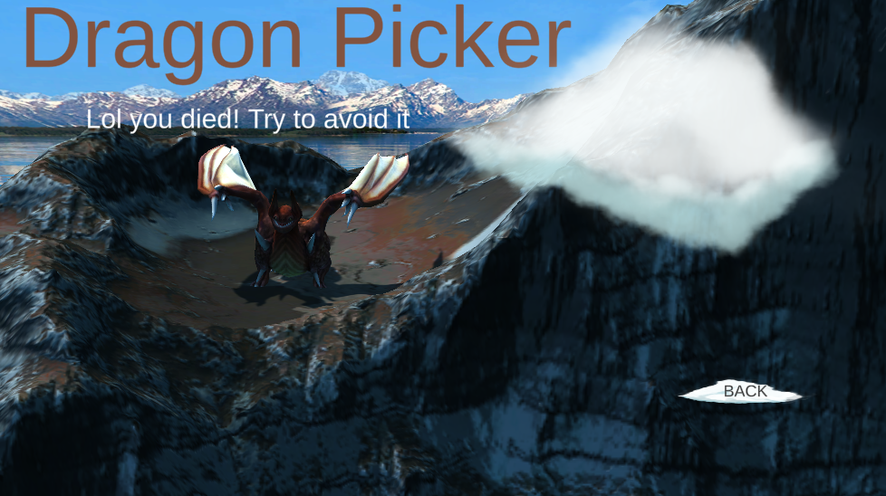
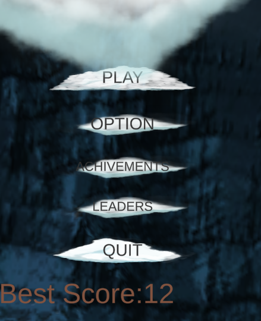
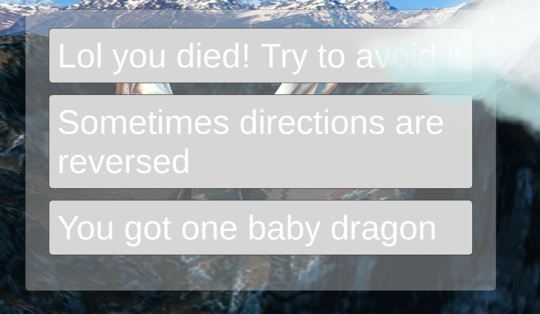
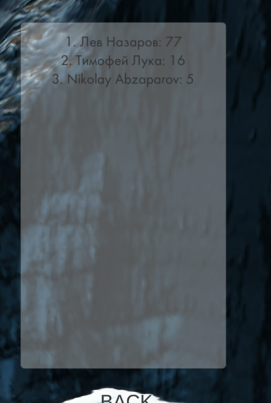

# РАЗРАБОТКА ИГРОВЫХ СЕРВИСОВ
Отчет по лабораторной работе #5 выполнил:
- Абзапаров Николай Дмитриевич
- РИ300012
### Ссылка на репозиторий с проектом: https://github.com/Abzaparov-Nikolay/DragonPicker

Отметка о выполнении заданий (заполняется студентом):

| Задание | Выполнение | Баллы |
| ------ | ------ | ------ |
| Задание 1 | * | 60 |
| Задание 2 | * | 20 |
| Задание 3 | * | 20 |

знак "*" - задание выполнено; знак "#" - задание не выполнено;

Работу проверили:
- к.т.н., доцент Денисов Д.В.
- к.э.н., доцент Панов М.А.
- ст. преп., Фадеев В.О.

## Цель работы
Создание интерактивного приложения с рейтинговой системой
пользователя и интеграция игровых сервисов в готовое приложение.

## Задание 1
1. Создал скрипт YandexSDKManager, прикрепил его к объекту на сцене
```  cs
public class YandexSDKManager : MonoBehaviour
{
    public TextMeshProUGUI textBox;
    public UnityEvent authorizationEvent;

    private bool isFirstLaunch = true;

    
    public void AuthorizationSuccessfull()
    {
        textBox.text = $"Authorization successfull. Hello, {YandexGame.playerName}!";
    }

    public void AuthorizationFailed()
    {
        textBox.text = "Authorization failed.";
        YandexGame.AuthDialog();
    }

    private void OnEnable()
    {
        YandexGame.GetDataEvent += ReceiveSDKData;
    }

    private void OnDisable()
    {
        YandexGame.GetDataEvent -= ReceiveSDKData;
    }

    public void ReceiveSDKData()
    {
        if(YandexGame.SDKEnabled && isFirstLaunch)
        {
            textBox.text = "SDK enabled. Waiting for authorization.";
            isFirstLaunch = false;
            authorizationEvent.Invoke();
        }
    }
}
```

2. Забилдил и проверил на Яндекс играх аутентификацию
   
3. Добавил сохранение полученных пользователем очков 
``` cs 
public void SaveScore(int score)
{
    YandexGame.savesData.score = score;
    YandexGame.SaveProgress();
}
```
4. Создал область, где будет выводится лучший счет игрока
   
5. Реализовал сохранения лучшего счета и вывода его на экран главного меню
   ``` cs
   if (YandexGame.savesData.bestScore < score)
            YandexGame.savesData.bestScore = score;
   ```
   
6. Реализовал отображение имени игрока над персонажем<br>
   
7. Создал отображение и сохранение достижений пользователя
``` cs
public void SaveAchivement(string achivement)
{
    if(!YandexGame.savesData.achivements.Contains(achivement))
        YandexGame.savesData.achivements = YandexGame.savesData.achivements.Append(achivement).ToArray();
     YandexGame.SaveProgress();
}
```



## Задание 2
Что можно добавить в проект, связанное с YandexSDK:
1) Локализация. Является переводом пользовательского интерфейса, документации и сопутствующих файлов программного обеспечения с одного языка на другой.
2) Платежи. Внутриигровые покупки скинов на персонажа, дракона, драконьи яйца
3) Показ рекламы с вознаграждением. Достижение за просмотр 15 рекламных роликов


## Задание 3

1) Настроил Сохранение и отображение лучшего счета 
   
2) Улучшил отображение достижений
   
3) Реализовал вывод таблицы лидеров по очкам в приложении
   


# Выводы
Понял, что ContentSizeFitter работает не на child-ах, а на других компонентах объекта, к которому он прикреплен. Научился получать и сохранять информация об игроках с помощью сервисов Яндекс Игр. Понял, как лучше реализовывать Scroll View.

## Powered by

**BigDigital Team: Denisov | Fadeev | Panov**